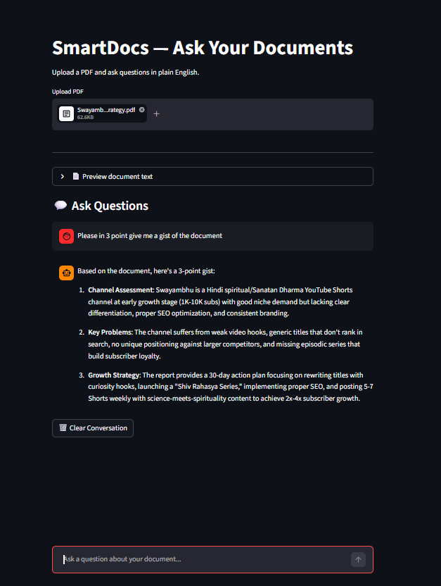

# SmartDocs — Ask Your Documents

Upload any PDF and ask questions in plain English. 
Powered by Claude AI.

## 🌐 Live Demo
👉 [Try SmartDocs](https://smartdocs-ai.streamlit.app)

## 🎥 Demo

## smart-docs V2

## What It Does
- Upload any PDF document
- Ask questions in plain English
- Get accurate answers instantly
- Full multi-turn conversation memory
- Remembers context across multiple questions

## Tech Stack
- Python
- Claude API (Anthropic)
- Streamlit
- PyPDF2

## Built By
Sumit Sharma — Senior Full Stack Engineer
[LinkedIn](https://www.linkedin.com/in/sumit-sharma-dev)

## Run Locally
1. Clone the repo
2. Install dependencies:
   pip install -r requirements.txt
3. Create .env file:
   ANTHROPIC_API_KEY=your-key-here
4. Run:
   streamlit run app.py

## Use Cases
- CA firms querying financial documents
- Law offices searching case files
- Coaching institutes answering student queries
- Any business with document-heavy workflows
